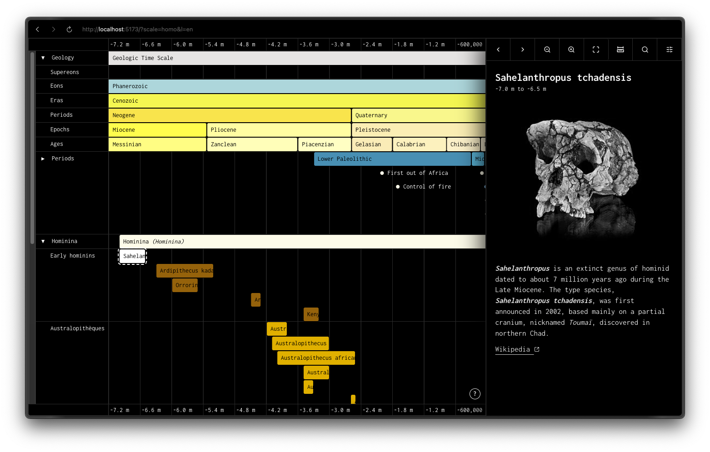

# temporus



temporus is an open-source tool for visualizing historical and geological events at different time scales to appreciate the complexity and evolution of the Earth and humanity (also short as it is in comparison). It's built with Vite, Tailwind CSS, Alpine.js and TypeScript.

## 🗃️ Data Contributions

Every contribution is welcome! You can contribute to the data by adding or editing the CSV files in the `src/data/sources` directory. If you don't know how to contribute on Github, here is a [guide](https://docs.github.com/en/get-started/exploring-projects-on-github/contributing-to-a-project). Also, feel free to open a [discussion](https://github.com/Yago/temporus/discussions) or an [issue](https://github.com/Yago/temporus/issues), but know that a contribution will be more taken into account than a simple discussion or issue.

## 👨‍💻 Dev requirements
- [🥟 bun](https://bun.com/)

## 🚀 Getting Started
Install dependencies:

```bash
bun install
```

Start the development server:

```bash
bun run dev
```

Build for production:

```bash
bun run build
```

Preview the production build locally:

```bash
bun run preview
```

## 🛠️ Useful Scripts
- `bun run icons:build`: Generate SVG sprite from `src/icons/*.svg` into `public/icons.svg`.
- `bun run lint:js`: Run ESLint (no warnings allowed).
- `bun run fix:js`: Run ESLint with autofix.

## 📦 Project Structure

```
.
├── README.md
├── bun.lock            👈 Lockfile
├── dist                👈 Production build output
│   ├── assets          👈 Assets
│   ├── fonts           👈 Fonts
│   ├── icons.svg       👈 SVG sprite
│   ├── images          👈 Images
│   └── index.html      👈 HTML file
├── eslint.config.mjs   👈 ESLint configuration
├── package.json        👈 Package.json
├── public              👈 Public assets
│   ├── fonts           👈 Fonts
│   ├── icons.svg       👈 SVG sprite
│   └── images          👈 Images
├── src                 👈 Source code
│   ├── components      👈 Components
│   ├── config          👈 Configuration
│   ├── data            👈 Data
│   ├── global.d.ts     👈 Global types
│   ├── icons           👈 Icons
│   ├── locales         👈 Locales
│   ├── main.ts         👈 Main entry point
│   ├── pages           👈 Pages
│   ├── stores          👈 Stores
│   ├── styles          👈 Styles
│   ├── types           👈 Types
│   └── utils           👈 Utilities
├── tsconfig.json       👈 TypeScript configuration
└── vite.config.ts      👈 Vite configuration
```

## Notes
- After adding or changing SVG icons in `src/icons/`, run `bun run icons:build` to refresh `public/icons.svg`.
- Deploy the contents of `dist/` to any static host.
